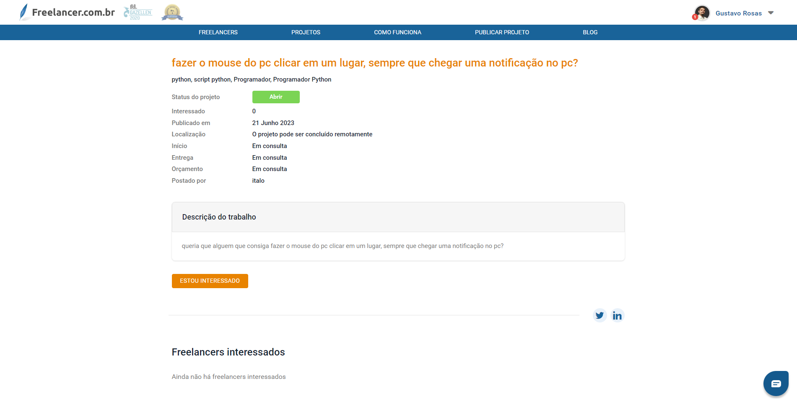
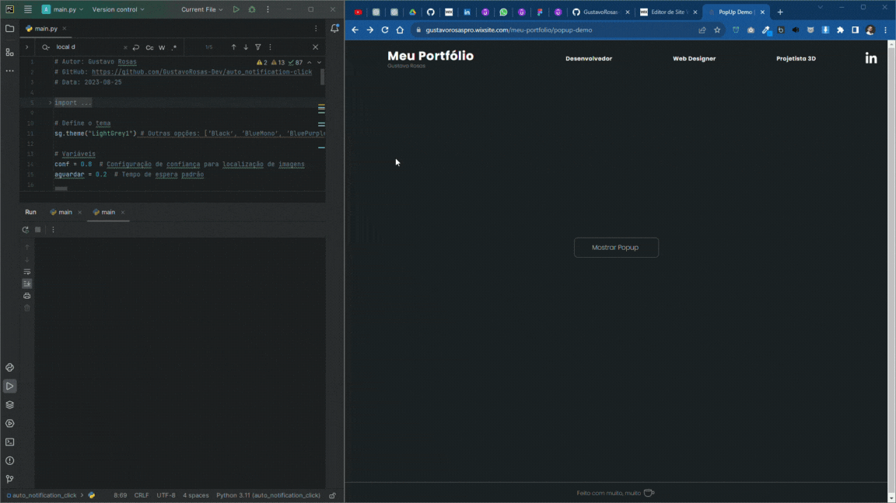
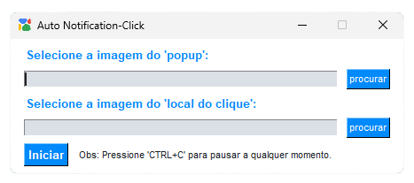

# Auto Notification-Click
Automatização simples para fechar pop-ups e clicar em um local desejado em resposta a notificações.

## Sobre o Projeto

Este script em Python foi criado para automatizar o processo de fechar pop-ups e realizar cliques em uma posição específica sempre que uma notificação é exibida na tela do computador. Ele usa a biblioteca `pyautogui` para interagir com a interface gráfica e o `keyboard` para permitir a interrupção do script pelo usuário.

## Contexto

Este projeto é baseado em uma necessidade real enfrentada por um cliente que publicou um projeto no site freelancer. Embora eu não vá entrar em contato com esse cliente e resolver efetivamente o problema dele, usei essa situação como inspiração para desenvolver o "Auto Notification-Click".

## Necessidade do Cliente

O cliente estava procurando uma solução para automatizar a interação com notificações em seu computador. Ele precisava que pop-ups fossem fechados automaticamente e que um local específico fosse clicado sempre que uma notificação aparecesse na tela.



## Solução Desenvolvida

Com base nessa necessidade, criei o "Auto Notification-Click", um script Python que utiliza a biblioteca `pyautogui` para interagir com a interface gráfica. O script é capaz de localizar pop-ups e clicar em posições específicas na tela em resposta a notificações.

#### GIF Demonstração
 

#### Captura de Tela
 

## Funcionalidades

- Localiza um pop-up na tela com base em uma imagem e fecha-o.
- Localiza um local específico na tela com base em uma imagem e clica nele.
- Pode ser pausado a qualquer momento pressionando 'CTRL+C'.

## Pré-requisitos

- Python 3.x
- Bibliotecas: `pyautogui`, `keyboard`, `time`, `PySimpleGUI`

## Instalação

1. Clone este repositório:

   ```
   git clone https://github.com/GustavoRosas-Dev/auto_notification-click.git
   ```

2. Entre na pasta do projeto:

   ```
   cd auto-notification-click
   ```

3. Instale as dependências:

   ```
   pip install -r requirements.txt
   ```

## Uso

1. Execute o script desejado (`apenas_script.py` ou qualquer versão do `script_e_interface.py`).
2. Selecione a imagem que representa o pop-up e a imagem do local de clique.
3. Clique em "Iniciar Script".
4. Use 'CTRL+C' a qualquer momento para pausar o script.

## Contribuições

Contribuições são bem-vindas! Se você deseja melhorar este projeto, siga os passos abaixo:

1. Faça um fork do repositório.
2. Crie um novo branch para a sua funcionalidade (`git checkout -b feature/nova-funcionalidade`).
3. Faça as alterações necessárias e teste-as.
4. Faça o commit das suas alterações (`git commit -m 'Adicionada nova funcionalidade'`).
5. Envie para o seu repositório fork (`git push origin feature/nova-funcionalidade`).
6. Abra um Pull Request no repositório original.

## Licença

Distribuído sob a licença MIT. Veja `LICENSE` para mais informações.

## Nota
Espero que o "Auto Notification-Click" seja útil para outras pessoas que enfrentam problemas semelhantes de automação.

---

Feito com um ☕ por [Gustavo Rosas](https://github.com/GustavoRosas-Dev).
